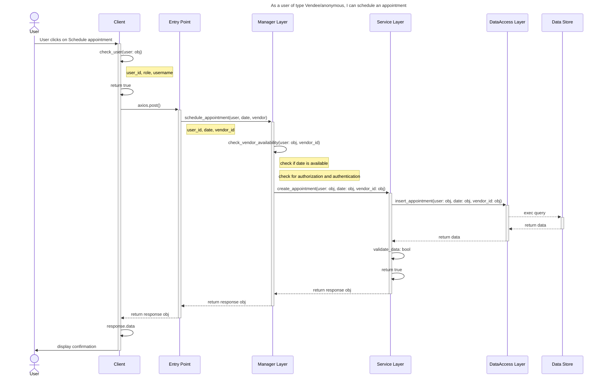

```mermaid
sequenceDiagram
title As a user of type Vendee/anonymous, I can schedule an appointment
actor User
participant Client
participant Entry Point
participant Manager Layer
participant Service Layer
participant DataAccess Layer
participant Data Store
User ->>+ Client: User clicks on Schedule appointment
Client ->> Client: check_user(user: obj)
note right of Client: user_id, role, username
Client ->> Client: return true
Client ->>+ Entry Point: axios.post()
Entry Point ->>+ Manager Layer: schedule_appointment(user, date, vendor)
note right of Entry Point: user_id, date, vendor_id
Manager Layer ->> Manager Layer: check_vendor_availability(user: obj, vendor_id)
note right of Manager Layer: check if date is available
note right of Manager Layer: check for authorization and authentication
Manager Layer ->>+ Service Layer: create_appointment(user: obj, date: obj, vendor_id: obj)
Service Layer ->>+ DataAccess Layer: insert_appointment(user: obj, date: obj, vendor_id: obj)
DataAccess Layer -->>+ Data Store: exec query
Data Store -->>- DataAccess Layer: return data
DataAccess Layer -->>- Service Layer: return data
Service Layer ->> Service Layer: validate_data: bool
Service Layer ->> Service Layer: return true
Service Layer -->>- Manager Layer: return response obj
Manager Layer -->>- Entry Point: return response obj
Entry Point -->>- Client: return response obj
Client ->> Client: response.data
Client ->>- User: display confirmation 


```