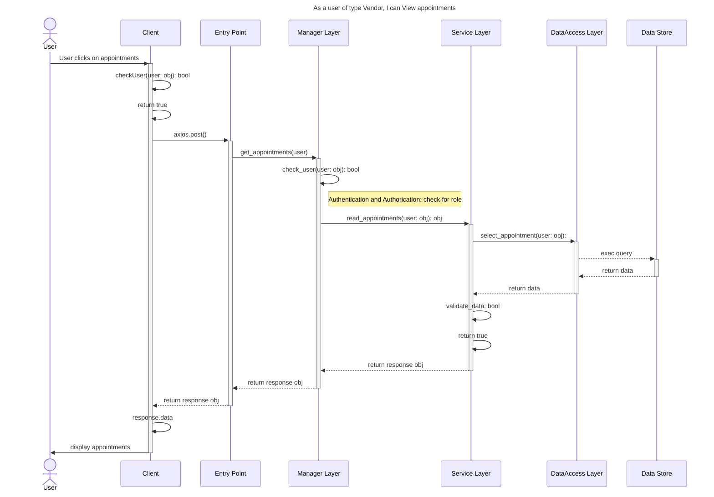

```mermaid
sequenceDiagram
title As a user of type Vendor, I can View appointments
actor User
participant Client
participant Entry Point
participant Manager Layer
participant Service Layer
participant DataAccess Layer
participant Data Store
User ->>+ Client: User clicks on appointments
Client ->> Client: checkUser(user: obj): bool 
Client ->> Client: return true
Client ->>+ Entry Point: axios.post()
Entry Point ->>+ Manager Layer: get_appointments(user) 
Manager Layer ->> Manager Layer: check_user(user: obj): bool
note right of Manager Layer: Authentication and Authorication: check for role
Manager Layer ->>+ Service Layer: read_appointments(user: obj): obj
Service Layer ->>+ DataAccess Layer: select_appointment(user: obj): 
DataAccess Layer -->>+ Data Store: exec query
Data Store -->>- DataAccess Layer: return data
DataAccess Layer -->>- Service Layer: return data
Service Layer ->> Service Layer: validate_data: bool
Service Layer ->> Service Layer: return true
Service Layer -->>- Manager Layer: return response obj
Manager Layer -->>- Entry Point: return response obj
Entry Point -->>- Client: return response obj
Client ->> Client: response.data
Client ->>- User: display appointments 

```